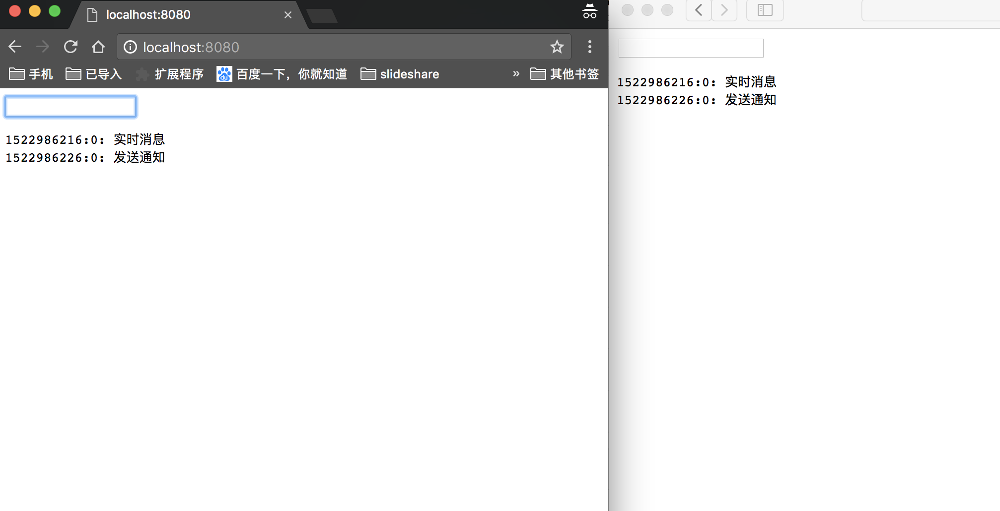

# nginx nchan module docker image

nchan for build real time application

## how to use

```bash
see directory example
```

## how to run demo

```bash
docker build -t nchan-demo .

docker run -d -p 8080:80 nchan-demo

or with the dockerhub build image

docker run -d -p 8080:80 dalongrong/nchan:demo

or  with docker-compose

docker-compose build
docker-compose up -d
```

## some images

